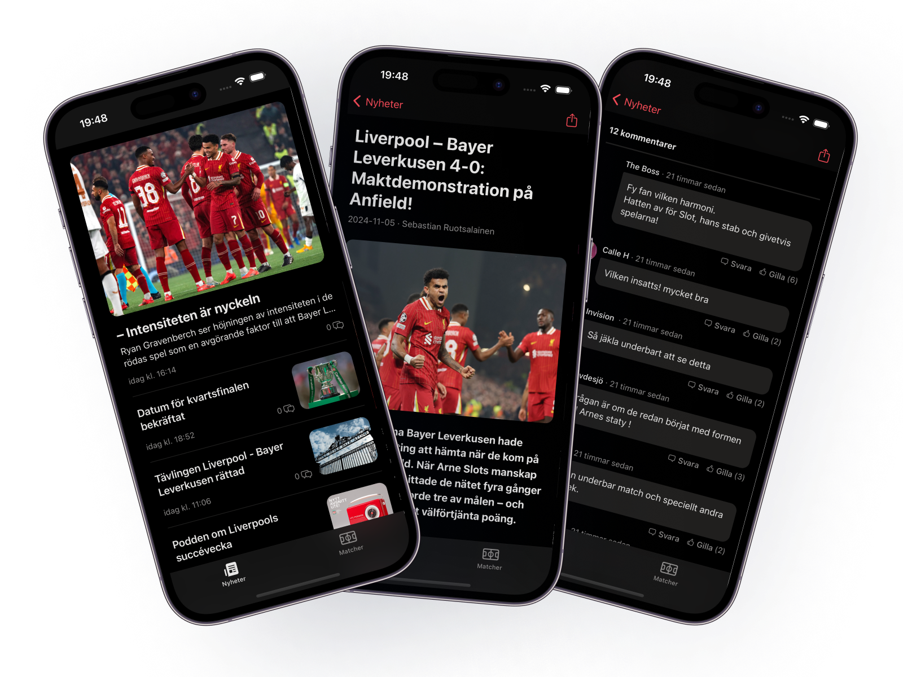

# LFC.se

> Monorepo for the unofficial https://www.lfc.se companion app and its backend
> services.



## Structure

This is a [pnpm workspace](https://pnpm.io/workspaces) orchestrated with
[Turborepo](https://turbo.build/).

```
apps/
  mobile          @lfc/mobile        Expo / React Native app
  notifications   @lfc/notifications Hono backend that pushes new-article alerts (Vercel)
packages/
  api             @lfc/api           Transport-agnostic lfc.se API client + types
```

## Getting started

```sh
pnpm install            # install every workspace
pnpm dev                # run all dev servers (turbo)
pnpm typecheck          # typecheck every package
pnpm lint               # lint every package
pnpm format             # check formatting (oxfmt)
```

Target a single package with a filter:

```sh
pnpm --filter @lfc/mobile dev          # expo start
pnpm --filter @lfc/notifications dev    # local Hono server
```

## Apps

### 📱 `@lfc/mobile`

The Expo app: news, games, standings, comments and push notifications. See
[`apps/mobile`](apps/mobile).

### 🔔 `@lfc/notifications`

A small Hono service, deployed to Vercel, that polls lfc.se for new articles and
pushes them to the mobile app via Expo Push. This replaces the old on-device
background poll (which the OS throttled heavily) with prompt server-driven
delivery. Setup and deployment: [`apps/notifications/README.md`](apps/notifications/README.md).

## Notifications, end to end

1. On launch (with notifications enabled) the mobile app registers its Expo push
   token with the backend (`POST /devices`).
2. Vercel Cron hits the backend's `/cron/poll` on a schedule.
3. The backend fetches the latest articles via `@lfc/api`, compares them to
   the articles not yet announced, and sends an Expo push for each new one.
4. The app receives the push and deep-links to the article on tap.

If no backend is configured (`EXPO_PUBLIC_NOTIFICATIONS_API_URL` unset) or it's
unreachable, the app falls back to its on-device background poll, so
notifications still work — just less promptly.
